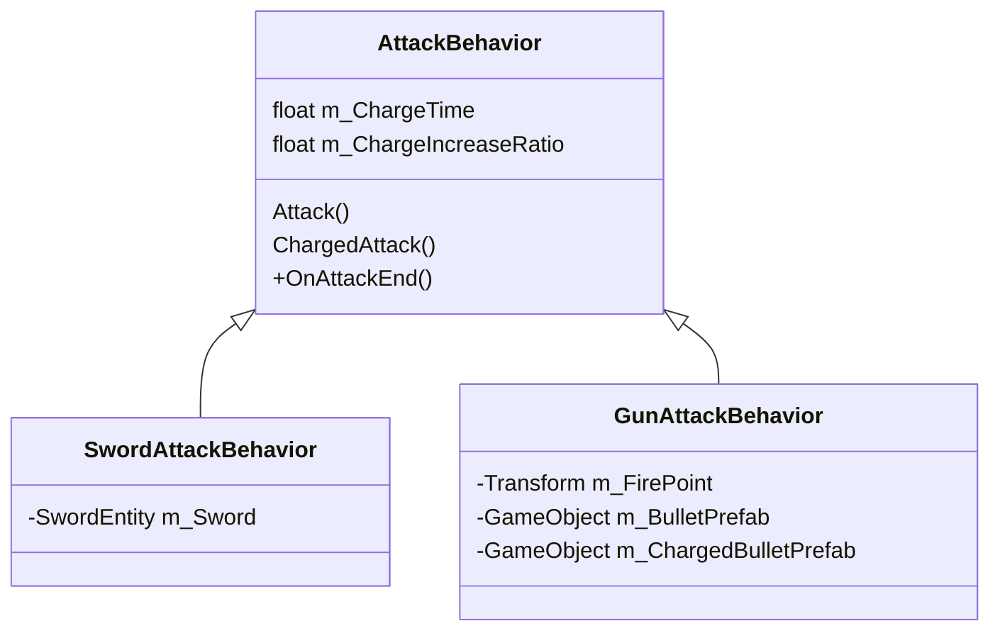
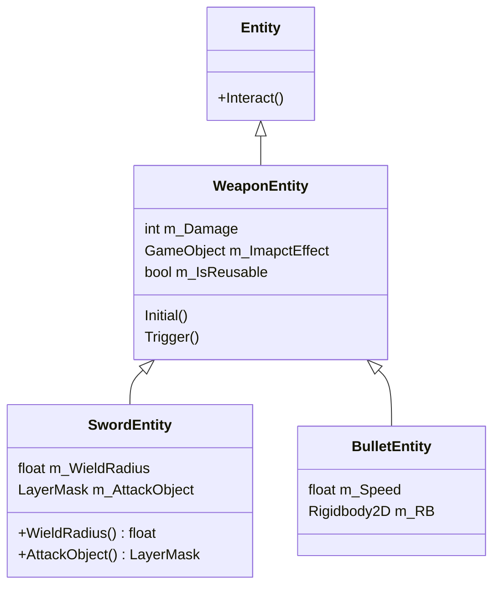
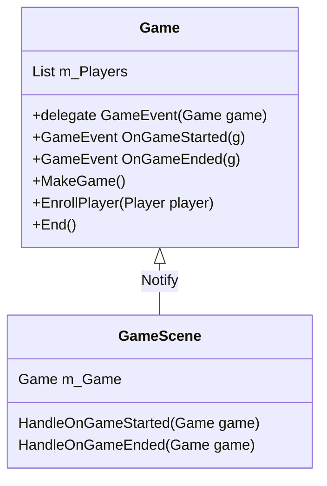
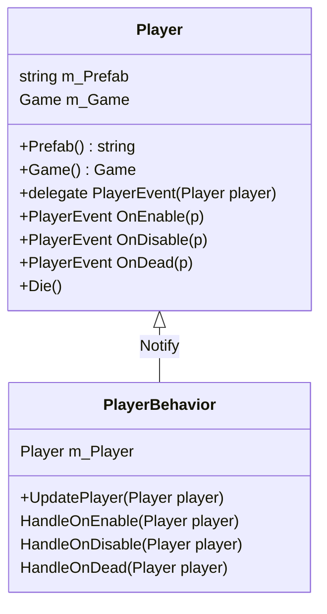

### Attack Behavior

### Entity

* 在 Weapon Entity, 我試著使用設計模式 Hooks and Anchors 使其在繼承的子物件去決定各個函式的行為；而上層物件決定函示執行的邏輯及時機。

### Game, GameScene, Player and Player Behavior

* 遊戲及玩家使用設計模式 Observer 以達到介面跟遊戲邏輯分離，降低程式間依賴性。

#### Game and GameScene

#### Player and PlayerBehavior

